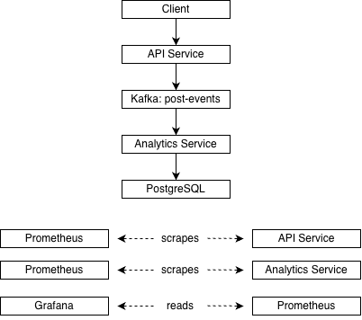
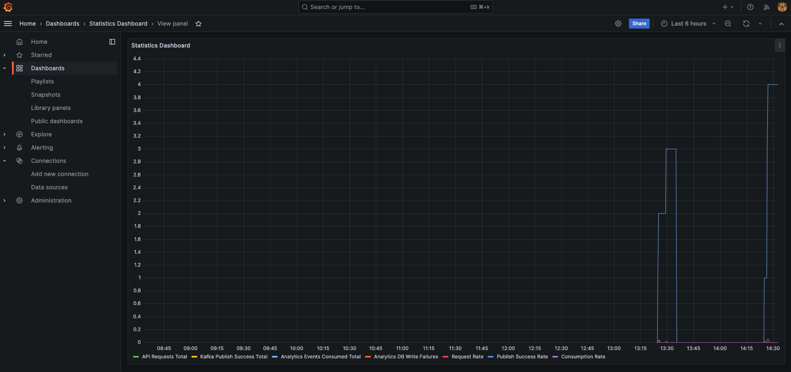
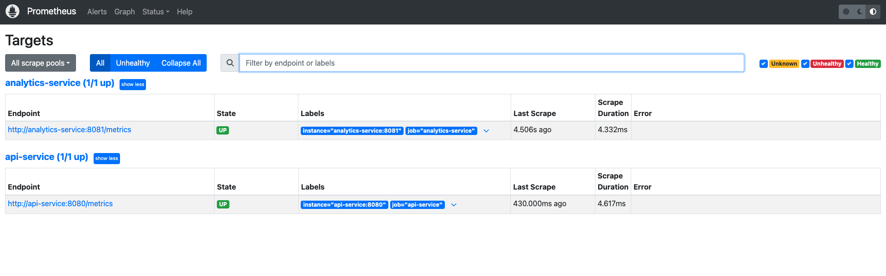

# Pulse Stream

Pulse Stream is an event-driven microservices system built with Go, Kafka, PostgreSQL, Prometheus, Grafana, and Docker Compose to ingest, process, persist, and monitor social media analytics events.

## Tools used to develop

Pulse-Stream uses cloud-native and event-driven systems, asynchronous processing, metrics instrumentation, observability, and containerized multi-service development.

## Architecture

Client -> API Service -> Kafka -> Analytics Service (-> Prometheus -> Grafana) -> PostgreSQL


## Tech Stack

- Go
- Apache Kafka
- PostgreSQL
- Docker Compose
- Prometheus
- Grafana
- Go testing package


## Features

- Accepts social media post events through a REST API
- Publishes events asynchronously to Kafka
- Consumes and processes analytics events in a background worker
- Persists per-platform analytics in PostgreSQL
- Exposes analytics through a read endpoint
- Tracks service metrics with Prometheus
- Visualizes system metrics in Grafana
- Runs the full stack with Docker Compose

## Project Structure

pulse-stream/
├── api-service/
├── analytics-service/
├── monitoring/
│   ├── prometheus/
│   └── grafana/
├── postgres/
├── docker-compose.yml
└── README.md

## Run the Project

### 1. Start the full stack

```bash
docker compose up --build
```

### 2. API Endpoints
- API: http://localhost:8080
- API metrics: http://localhost:8080/metrics
- Worker metrics: http://localhost:8081/metrics
- Prometheus: http://localhost:9090
- Grafana: http://localhost:3000

## Example requests

### Example: Send an Event

```bash
curl -X POST http://localhost:8080/posts \
  -H "Content-Type: application/json" \
  -d '{
    "post_id":"p_001",
    "platform":"twitter",
    "content_type":"text",
    "engagement_score":42,
    "created_at":"2026-03-09T16:00:00Z"
  }'
```

### Example: Read Analytics


```bash
curl http://localhost:8080/analytics/platforms
```

# Testing

## Running Tests


### API service
```bash
cd api-service
go test ./...
```
```bash
cd analytics-service
go test ./...
```

## Observability

The system exposes Prometheus metrics from both services and visualizes them in Grafana.

Tracked metrics include:
- API HTTP requests
- Kafka publish success/failure
- Analytics events consumed
- Database write failures


## Future Improvements

- Add retry/backoff for service startup dependencies
- Add dead-letter queue handling
- Add Kubernetes deployment manifests
- Add CI pipeline for automated test and image builds
- Add tracing for request-to-event observability

- Add retry/backoff for service startup dependencies
- Add health checks and readiness probes
- Add dead-letter queue handling
- Add Kubernetes deployment manifests
- Add CI pipeline for automated test and image builds
- Add tracing for request-to-event observability

## Architecture Diagram



## Screenshots




